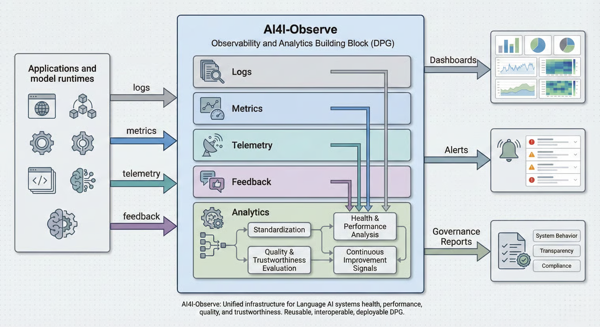

# Introduction

AI4I-Observe is a foundational observability and analytics building block for large-scale Language AI ecosystems intended for global and multilingual adoption.

As Language AI systems expand across countries, domains, and real-world use cases, the need for trustworthy performance monitoring, transparent evaluation, and rapid quality improvement becomes essential. AI4I-Observe provides a plug-and-play observability and analytics layer that enables governments, enterprises, academia, and open-source contributors to measure system health, model quality, user behavior, feedback loops, and operational efficiency.

Built as a Digital Public Good (DPG), Observe offers a unified infrastructure for collecting logs, telemetry, performance metrics, explicit feedback, implicit feedback, and annotation-driven quality indicators. It acts as the central nervous system of the Language AI stack, enabling objective measurement, continuous improvement, and responsible deployment.

<figure><figcaption></figcaption></figure>

